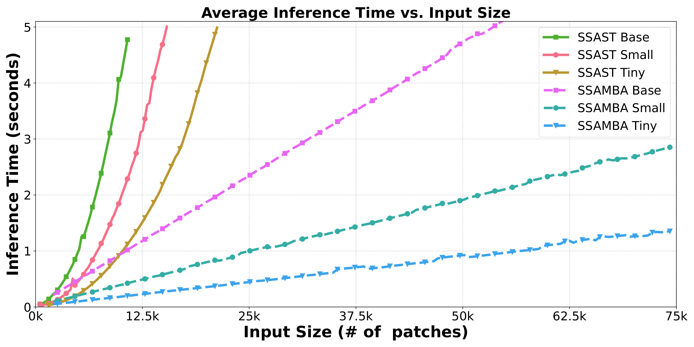
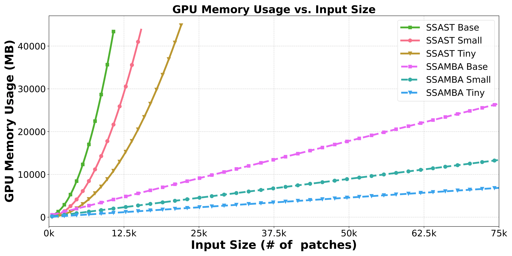

# SSAMBA: Self-Supervised Audio Mamba

⚠️ **Under Construction** ⚠️

We will add recipes for fine-tuning on more datasets later. 🛠️ Stay tuned!!!


## Introduction
This repository contains the official implementation (in PyTorch) of the the paper SSAMBA: Self-Supervised Audio Representation Learning with Mamba State Space Model. SSAMBA is an advanced audio representation learning model designed to leverage self-supervised learning techniques using the Mamba State Space Model. This project builds on the success of the Self-Supervised Audio Spectrogram Transformer (SSAST) and introduces novel methodologies to further enhance performance and efficiency on various audio tasks. 

## Installation

To install the necessary dependencies, you can use the following commands:

```bash
git clone https://github.com/SiavashShams/ssamba.git
cd ssamba
pip install -r requirements.txt
```

## Architecture


## Efficiency Comparison
SSAMBA is approximately 92.7\% faster in batch inference speed and 95.4\% more memory-efficient than SSAST for the tiny model size with an input token size of 22k.
<p align="center">
  
  
</p>

## Pretraining

We pretrained SSAMBA with various sizes (base, small, tiny) for patches (250, 300, and 400) on a mixture of unlabeled audios from AudioSet and LibriSpeech. You can find these weights in the "Pretrained Model Weights" section below. However, if you want to pretrain the model from scratch, follow this recipe:

1. **Navigate to the Directory**: Change to the directory containing the pretraining scripts. You can do this by running the following command in your terminal:
    ```bash
    cd ssamba/src/pretrain
    ```

2. **Adjust the Script**: Edit the `run_mask_patch_amba.sh` script to update the paths to your data files, Mamba encoder configurations, and any other necessary hyperparameters. Make sure that all paths and settings accurately reflect your local environment and the specifics of the dataset you are using.

3. **Run the Script**: After making the necessary adjustments, execute the script to start the pretraining process. You can run the script directly from the terminal with the following command:
    ```bash
    ./run_mask_patch_amba.sh
    ```

## Pretrained Model Weights

The pretrained model weights for our SSAMBA model in sizes (base, small, and tiny) for different number of masked patches (400, 300, 250) can be found at:

[Pretrained Model Weights](https://drive.google.com/drive/u/1/folders/1E1gf5SxdSByDJ16_WQvzTKn8lIoYtZiX)


## License
The license for borrowed code can be found in [LICENSE](https://github.com/SiavashShams/ssamba/blob/main/LICENSE) file. 
We acknowledge the wonderful work of [SSAST](https://arxiv.org/abs/2110.09784), and [Vision Mamba](https://arxiv.org/abs/2401.09417). 

## Citing
If you find this work helpful, please consider giving us a star 🌟 and citing:

```bibtex
@article{shams2024ssamba,
      title={SSAMBA: Self-Supervised Audio Representation Learning with Mamba State Space Model},
      author={Siavash Shams and Sukru Samet Dindar and Xilin Jiang and Nima Mesgarani},
      year={2024},
      eprint={2405.11831},
      archivePrefix={arXiv},
      primaryClass={eess.AS},
      journal={arXiv preprint arXiv:2405.11831}
}

```
