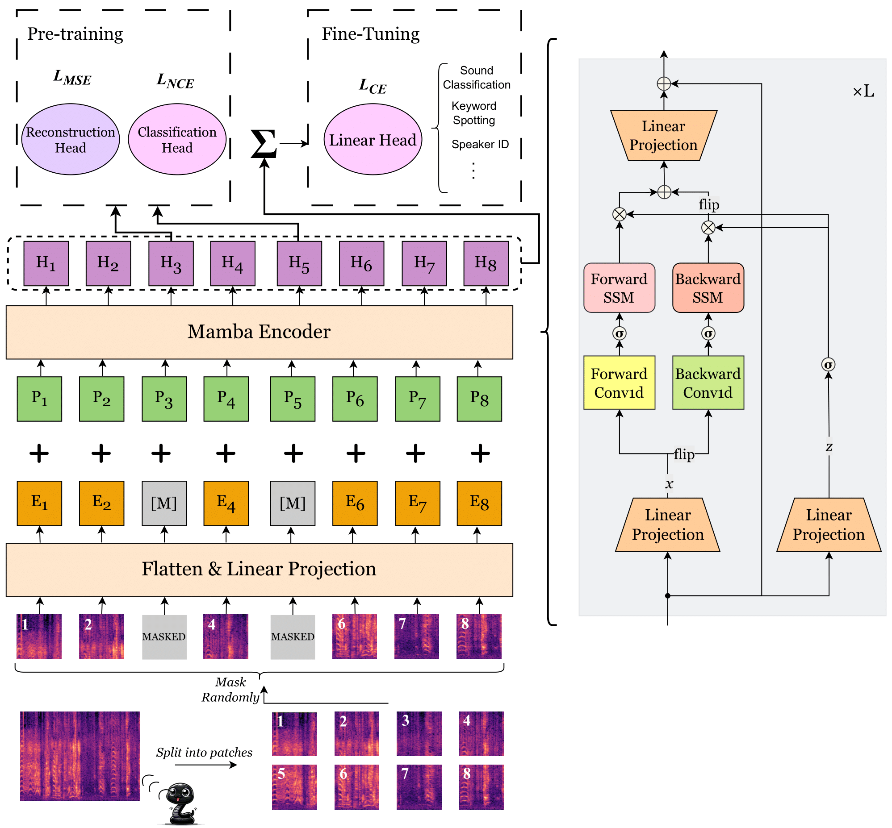

# SSAMBA: Self-Supervised Audio Mamba

[](https://arxiv.org/abs/2405.11831)
[](https://huggingface.co/attentionisallyouneed369/ssamba)


## News
- **[2024-09-01]**: Paper accepted to IEEE Spoken Language Technology (SLT) Workshop 2024
- **[2024-08-05]**: Looking for Contributors: Seeking help to implement a HuggingFace-compliant version of SSAMBA. Interested? Please reach out!
- **[2024-07-16]**: Finetuning recipes for IEMOCAP, SCv1 and SCv2 datasets are added.
- **[2024-07-01]**: Added a new task of dynamic audio scene labeling with 1 minute audio input from the Urban8k Sound dataset.
- **[2024-05-20]**: Made our paper available on arXiv.


## Introduction
This repository contains the official implementation (in PyTorch) of the the paper SSAMBA: Self-Supervised Audio Representation Learning with Mamba State Space Model. SSAMBA is an advanced audio representation learning model designed to leverage self-supervised learning techniques using the Mamba State Space Model. This project builds on the success of the Self-Supervised Audio Spectrogram Transformer (SSAST) and introduces novel methodologies to further enhance performance and efficiency on various audio tasks. 

## Installation

To install the necessary dependencies, you can use the following commands:

```bash
git clone https://github.com/SiavashShams/ssamba.git
cd ssamba
pip install -r requirements.txt
```
Next, clone the Vision Mamba repository inside your ssamba directory:
```bash
git clone https://github.com/hustvl/Vim.git
```

If you encounter issues with `bimamba_type`, please refer to the steps outlined in this [GitHub issue comment](https://github.com/hustvl/Vim/issues/14#issuecomment-1964685563).

## Architecture



## Efficiency Comparison
SSAMBA is approximately 92.7\% faster in batch inference speed and 95.4\% more memory-efficient than SSAST for the tiny model size with an input token size of 22k.
<p align="center">
  
  
</p>

## Pretraining

We pretrained SSAMBA with various sizes (base, small, tiny) for patches (250, 300, and 400) on a mixture of unlabeled audios from AudioSet and LibriSpeech. You can find these weights in the "Pretrained Model Weights" section below. However, if you want to pretrain the model from scratch, follow this recipe:

1. **Navigate to the Directory**: Change to the directory containing the pretraining scripts. You can do this by running the following command in your terminal:
    ```bash
    cd ssamba/src/pretrain
    ```

2. **Adjust the Script**: Edit the `run_mask_patch_amba.sh` script to update the paths to your data files, Mamba encoder configurations, and any other necessary hyperparameters. Make sure that all paths and settings accurately reflect your local environment and the specifics of the dataset you are using.

3. **Run the Script**: After making the necessary adjustments, execute the script to start the pretraining process. You can run the script directly from the terminal with the following command:
    ```bash
    ./run_mask_patch_amba.sh
    ```

## Pretrained Model Weights

The pretrained model weights for our SSAMBA model in sizes (base, small, and tiny) for different number of masked patches (400, 300, 250) can be found at:

[Pretrained Model Weights](https://drive.google.com/drive/u/1/folders/1E1gf5SxdSByDJ16_WQvzTKn8lIoYtZiX)

## Finetuning

### Audioset_20k, ESC-50 and Speech Commands V2:

To finetune the pretrained SSAMBA on the balanced Audioset or ESC-50 datasets, follow these steps:

1. **Navigate to the finetuning directory:**
   - For Audioset:
     ```bash
     cd src/finetune/audioset
     ```
   - For ESC-50:
     ```bash
     cd src/finetune/esc50
     ```
   - For Speech Commands v2:
     ```bash
     cd src/finetune/speechcommands_v2
     ```


2. **Adjust the paths and hyperparameters:**
   Edit `run_as_amba.sh`, `run_esc_patch_amba.sh` and `run_sc_amba.sh`. Adjust the paths and hyperparameters as needed for your dataset.

3. **Configure SLURM job submission (if using SLURM):**
   Add the models you want to finetune to `submit_jobs.sh`:
   ```bash
   #!/bin/bash

   # Array of pre-trained models
   declare -a models=("ssamba_tiny_400")

   # Submit a job for each model
   for model in "${models[@]}"; do
       sbatch run_as_amba.sh $model
   done
   ```

4. **Run the job submission script:**
   Execute the `submit_jobs.sh` script in the terminal to start the finetuning process:
   ```bash
   ./submit_jobs.sh
   ```

Make sure to monitor the jobs and adjust any parameters as needed to suit your specific requirements and hardware configuration.

### VoxCeleb and IEMOCAP

### Step 1: Install the SUPERB Package

1. **Clone the SUPERB repository**:
   ```bash
   git clone https://github.com/s3prl/s3prl.git
   ```

2. **Navigate to the s3prl directory**:
   ```bash
   cd s3prl
   ```

3. **Install the package**:
   ```bash
   pip install -e ./
   ```

### Step 2: Prepare the Fine-Tuning Scripts

1. **Copy our files**:
   - Copy the files from `src/finetune/voxceleb1/ssast` to `s3prl/s3prl/upstream/ssast`.

### Step 3: Adjust Paths and Specify Models

1. **Edit the `run_sid.sh` or `run_er.sh` file**:
   - Adjust the paths in the `run_sid.sh` or `run_er.sh` file to point to the correct directories for your dataset and model.

2. **Specify models in `submit_jobs_amba.sh`**:
   - Edit the `submit_jobs_amba.sh` script to specify the models you want to fine-tune.

### Step 4: Run the Fine-Tuning Script

1. **Execute the `submit_jobs_amba.sh` script**:
   - In the terminal, navigate to the directory containing `submit_jobs_amba.sh` and run:
     ```bash
     ./submit_jobs_amba.sh
     ```


## License
The license for borrowed code can be found in [LICENSE](https://github.com/SiavashShams/ssamba/blob/main/LICENSE) file. 
We acknowledge the wonderful work of [SSAST](https://arxiv.org/abs/2110.09784), and [Vision Mamba](https://arxiv.org/abs/2401.09417). 

## Citing
If you find this work helpful, please consider giving us a star 🌟 and citing:

```bibtex
@article{shams2024ssamba,
      title={SSAMBA: Self-Supervised Audio Representation Learning with Mamba State Space Model},
      author={Siavash Shams and Sukru Samet Dindar and Xilin Jiang and Nima Mesgarani},
      year={2024},
      eprint={2405.11831},
      archivePrefix={arXiv},
      primaryClass={eess.AS},
      journal={arXiv preprint arXiv:2405.11831}
}

```
